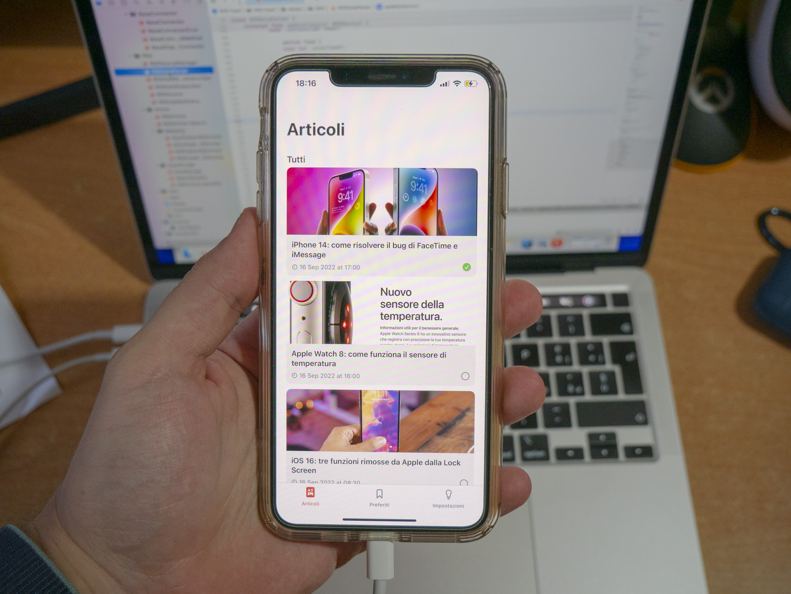

# ItechMania (SwiftUI News App)- Santanocito Matteo
## All News in One Tap!
 

This project represents the development of the ItechMania app in SwitfUI 5.

iTechMania was born in January 2014. The site has grown rapidly since that day, which is why it was decided in October 2014 to purchase the itechmania.it domain. Today iTechMania is a consolidated reality, thanks also to the collaboration of numerous companies in the sector and thanks to the support of its loyal users. iTechMania is not just a website, but it is also a YouTube Channel, a Telegram Channel and one of the most numerous and active Facebook Groups in the industry, where people can draw on to learn, get help or simply stay up to date on the latest technological innovations.

 
